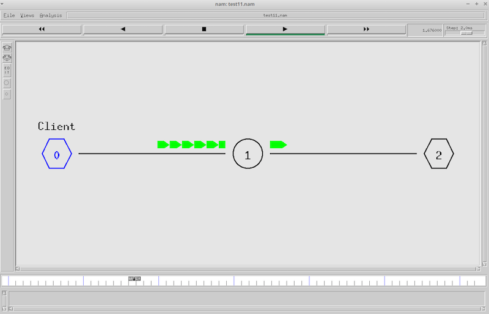
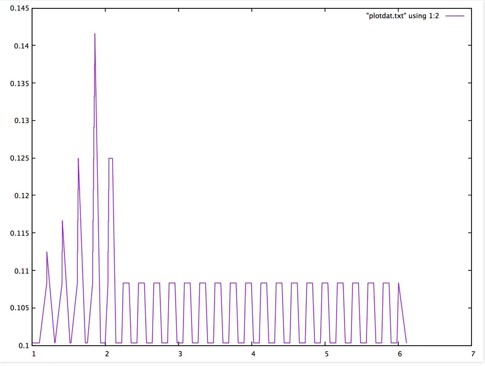
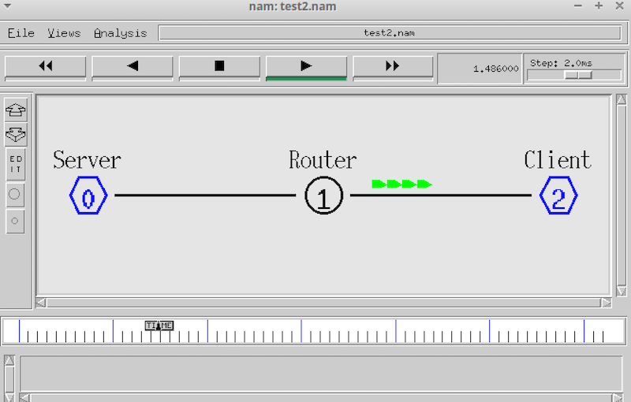
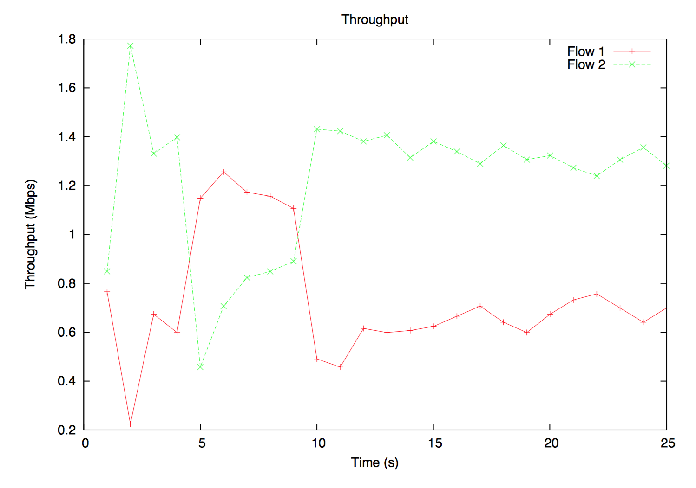
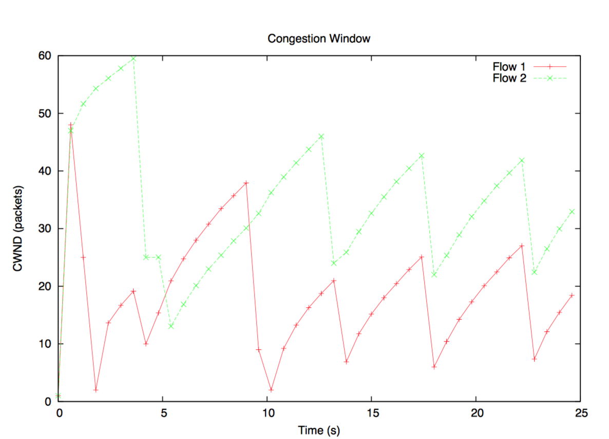

# Record of lots of experiments. 

## Q. How to calculate End to End delay for wired network using awk script in ns2.

## Answer

The Tcl script.

```
set ns [new Simulator]
set nt [open test11.tr w]

$ns trace-all $nt

set nf [open test11.nam w]
$ns namtrace-all $nf

$ns color 1 darkmagenta
$ns color 2 yellow
$ns color 3 blue
$ns color 4 green
$ns color 5 black


set totalNodes 3
for { set i 0} { $i < $totalNodes } { incr i } {
    set node_($i) [$ns node]
}

set server 0
set router 1
set client 2

$ns duplex-link $node_($server) $node_($router) 2Mb 50ms DropTail
$ns duplex-link $node_($router) $node_($client) 2Mb 50ms DropTail

$ns duplex-link-op $node_($server) $node_($router) orient right
$ns duplex-link-op $node_($router) $node_($client) orient right

$ns at 0.0 "$node_($server) label Server"
$ns at 0.0 "$node_($server) label Router"
$ns at 0.0 "$node_($server) label Client"
$ns at 0.0 "$node_($server) color blue"
$ns at 0.0 "$node_($server) color blue"

$node_($server) shape hexagon 
$node_($client) shape hexagon

set tcp [new Agent/TCP]

$ns attach-agent $node_($server) $tcp

set sink [new Agent/TCPSink]
$ns attach-agent $node_($client) $sink

$ns connect $tcp $sink

set ftp [new Application/FTP]

$ftp attach-agent $tcp

$tcp set fid_ 4

$ns at 1.0 "$ftp start"
$ns at 6.0 "$ftp stop"

proc finish {} {
    global ns nf nt
    $ns flush-trace 
    close $nf 
    close $nt
    puts "runnning nam"
    exec nam test11.nam &
    exec awk -f Delay.awk test11.tr > output.tr &

    exit 0
}

$ns at 10.0 "finish"
$ns run


```

- - -

**Nam Trace after running it.**




**The Awk Script to get data.**

```
BEGIN {
    highest_packet_id = 0;
} 

{
    action = $1;
    time = $2;
    node_1 = $3;
    node_2 = $4;
    src = $5;
    flow_id = $8;
    node_1_address = $9;
    node_2_address = $10;
    seq_no = $11;
    packet_id = $12;
    if (packet_id > highest_packet_id) highest_packet_id = packet_id;#
    getting start time is not a problem, provided you 're not starting#
    traffic at 0.0.#could test
    for sending node_1_address or flow_id here.
    if(start_time[packet_id] == 0) start_time[packet_id] = time;#
    only useful
    for small unicast where packet_id doesn 't wrap.#
    checking receive means avoiding recording drops
    if (action != "d") {
        if (action == "r") {#
            could test
            for receiving node_2_address or flow_id here.
            end_time[packet_id] = time;
        }
    } else {
        end_time[packet_id] = -1;
    }
}
END {
    for (packet_id = 0; packet_id <= highest_packet_id; packet_id++) {
        start = start_time[packet_id];
        end = end_time[packet_id];
        packet_duration = end - start;
        if (start < end) printf("%f %f\n", start, packet_duration);
    }
}

```


Plotting using GNUPlot



- - - 

## Q. Creating data transfer between nodes using TCP in ns2.

## Answer

The Tcl script.

``` 

#——-Event scheduler object creation——–#
set ns [new Simulator]

#———-creating trace objects—————-#

set nt [open test2.tr w]
$ns trace-all $nt
#———-creating nam objects—————-#

set nf [open test2.nam w]
$ns namtrace-all $nf
#———-Setting color ID—————-#
$ns color 1 darkmagenta
$ns color 2 yellow
$ns color 3 blue
$ns color 4 green
$ns color 5 black

#———- Creating Network—————-#

set totalNodes 3

for {set i 0} {$i < $totalNodes} {incr i} {
set node_($i) [$ns node]
}

set server 0
set router 1
set client 2

#———- Creating Duplex Link—————-#
$ns duplex-link $node_($server) $node_($router) 2Mb 50ms DropTail
$ns duplex-link $node_($router) $node_($client) 2Mb 50ms DropTail

$ns duplex-link-op $node_($server) $node_($router) orient right
$ns duplex-link-op $node_($router) $node_($client) orient right

#————Labelling—————-#

$ns at 0.0 "$node_($server) label Server"
$ns at 0.0 "$node_($router) label Router"
$ns at 0.0 "$node_($client) label Client"

$ns at 0.0 "$node_($server) color blue"
$ns at 0.0 "$node_($client) color blue"

$node_($server) shape hexagon
$node_($client) shape hexagon
#————Data Transfer between Nodes—————-#

# Defining a transport agent for sending
set tcp [new Agent/TCP]

# Attaching transport agent to sender node
$ns attach-agent $node_($server) $tcp

# Defining a transport agent for receiving
set sink [new Agent/TCPSink]

# Attaching transport agent to receiver node
$ns attach-agent $node_($client) $sink

#Connecting sending and receiving transport agents
$ns connect $tcp $sink

#Defining Application instance
set ftp [new Application/FTP]

# Attaching transport agent to application agent
$ftp attach-agent $tcp

# Setting flow color
$tcp set fid_ 4

# data packet generation starting time
$ns at 1.0 "$ftp start"

# data packet generation ending time
$ns at 6.0 "$ftp stop"

#———finish procedure——–#

proc finish {} {
global ns nf nt
$ns flush-trace
close $nf
close $nt
puts "running nam…"
exec nam test2.nam &
exit 0
}

#Calling finish procedure
$ns at 10.0 "finish"
$ns run

```

**Snapshot of the nam simulation **



- - - 

## Graphing of throughput and congestion using ns2.

## Answer

Tcl Script.

```
set ns [new Simulator]
set nf [open ”nam.out” w]
set trace [open ”trace.tr” w] $ns namtrace−all $nf
$ns trace−all $trace

Agent/TCP set window 50 

proc finish {} {
	global nf trace ns
	$ns flush−trace close $nf
	close $trace
	puts ”Simulation complete”;
	set s1 [$ns node]
	set s2 [$ns node]
	set router [$ns node] set d [$ns node]
	exit 1
                 }
       
$ns duplex−link $s1 $router 1.5Mb 15ms DropTail 
$ns duplex−link $s2 $router 1.5Mb 15ms DropTail
 
$ns duplex−link $router $d 2Mb 15ms DropTail
set tcpSender1 [$ns create−connection ”TCP/Reno” $s1 ”TCPSink” $d 0] 
set tcpSender2 [$ns create−connection ”TCP/Reno” $s2 ”TCPSink” $d 1]
set ftpSender1 [new Application/FTP] $ftpSender1 attach−agent $tcpSender1
set ftpSender2 [new Application/FTP] $ftpSender2 attach−agent $tcpSender2
$ns at 0.0 ”$ftpSender1 start” 
$ns at 0.0 ”$ftpSender2 start” 
$ns at 5 ”finish”
$ns run

```

Awk Script.

```
 BEGIN { 
 	last=0
    f1 = 0
    f2 = 0
    total = 0
}

{
 	if($5==”tcp”&&$1==”r”&&$4==”3”) 
 	{ 
 		if ($8 == ”0”) 
    		{
  				f1 += $6
			}
		if ($8 == ”1”) {
				f2 += $6
			}

		total += $6
        #every second
		
		if ($2 − 1 > last) { last = $2
		print $2 , ( f1 ∗8/1000000) , 
		f1 = 0 
		f2 = 0
		total = 0
		} 

	END {
	print $2, (f1 ∗8/1000000) , ( f2 ∗8/1000000) , ( total ∗8/1000000) 

}

```

### Plots using GNUPlot

**Throughput**



- - -




